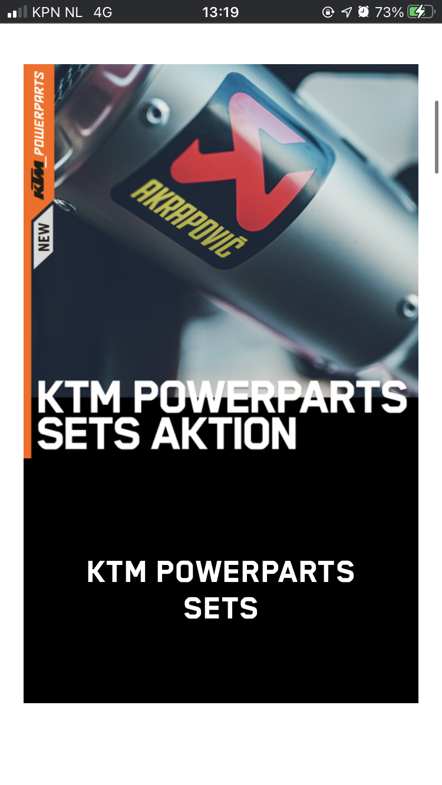

# Procesverslag
**Auteur:** -Palenque Groot-

Markdown cheat cheet: [Hulp bij het schrijven van Markdown](https://github.com/adam-p/markdown-here/wiki/Markdown-Cheatsheet). Nb. de standaardstructuur en de spartaanse opmaak zijn helemaal prima. Het gaat om de inhoud van je procesverslag. Besteedt de tijd voor pracht en praal aan je website.

## Bronnenlijst
1. (https://cssreference.io/property/background-size/"css")
2. (https://css-tricks.com/"css")
3. (https://https://validator.w3.org/)

## Eindgesprek (week 7/8)

-dit ging goed & dit was lastig-
Tijdens het laatste gesprek had ik nod niet alle avv. Verder moest ik de responsiveness van de site nog wat beter maken. Daarnaast werkte mijn github niet dus dat was ook heel vervelend.

**Screenshot(s):**

-screenshot(s) van je eindresultaat-

-screenshot's menu-

-screenshot's home-

-screenshot's detailpagina-

## Voortgang 3 (week 6)

-same as voortgang 1-

Ik Ben deze week niet heel veel verder gekomen dan vorige week, dus wat betreft coderen heb ik geen vragen voor iris.

## Agenda voor meeting

| Palenque Groot
    • Waar kan ik de goede beoordelingsformulier vinden?.

## screen reader

Ik heb de screen reader toegepast op mijn site. De screen reader las door alles heen alleen de links die hij opnoemde kwamen een beetje vaag over. Ik heb de links gewoon over genomen van de ktm website dus daar kan ik niets aan doen. Ik heb ook om het te dubbel checken de screen reader op de echte ktm site geprobeerd en dat was het zelfde.

Gaat de screen reader duidelijk over de header heen?
- De screen reader leest alles op

Is het duidelijk wat de linkjes doen met de screen reader?
- De screen reader leest alle titels van de links op, dus dat is goed. Het enige wat een beetje niet klopt is dat de screen reader heel snel praat.

## Voortgang 2 (week 5)

-same as voortgang 1-

### Stand van zaken
-screenshot(s) van hoe ver je bent met korte uitleg-

We gaan langzaam maar gestaagd verder, ik heb nu het hamburger menu in de header in me site er bij. Verder ben ik nog bezin om alles goed te stylen. In de footer moet ik de dropdowns nog maken en daar moet ik de classes nog veranderen naar pseudo paden.

-screenshot's home-

-screenshot's detailpagina-

### Agenda voor meeting

| Palenque Groot
    • Hoe zorg ik er voor dat me menubar sticky wordt.
    • hoe zorg ik er voor dat je niet kan scrollen als me menu open staat.
    • Hoe maak ik me button bewegend.
    • moet ik die flash img aanpassen?

| Sarah de Moes
    • Hoe gebruik ik de ::before goed voor de strepen
    • Hoe maak ik me tabbar sticky
    • Hoe fix ik me tabbar goed
    • Hoe maak ik de dropdown zoals op de website

| Susan van de Wiel
    • Hoe los ik de witruimte op (nergens zit een grote width, height, margin of padding op)
    • Hoe stijl ik de footer? Op internet staan alleen maar moeilijke dingen
    • Hoe maak ik de functieloze groene balk onder de foto (en hoe gaat deze responsive       mee?)
    • Hoeveel classes mag je meegeven? Ik heb er nu 1 op de main van de detailpagina, mag     dat wel?

| Suzanne Reesink
    • Weten hoe ik mijn carousel moet maken?
    • Hoe ik bij 'waarom sonos' de afbeeldingen over elkaar moet plaatsen en positioneren?
    • Hoe ik bij 'waarom sonons' die underline kleiner maak?
    • Hoeveel 'kopjes' ik bij de nieuws pagina moet maken?
    • Hoe krijg ik bij kerst mijn achtergrond img?

## Voortgang 1 (week 3)

### Stand van zaken

-dit ging goed & dit was lastig-
Met de homepagina dan ik niet heel veel moeite, het kost mij gewoon heel veel tijd. Als ik iets ook niet snap kan ik het altijd aan daan en tim vragen. Vaak kom ik er na dan achter dat ik zelf ook niet goed gelezen heb. oeps!

Wat wel even moeilijk was waren die sliders, ik wist niet goed hoe ik die moest maken. Bleek dus java script te zijn. Nu ik dat statisch mag neerzetten gaat het al weer wat vlotter.

-screenshot(s) van hoe ver je bent met korte uitleg-
-Ik ben vergeten een screanshot te maken, maar ik denk dat ik op zo'n 40 a 50% zit/zat tijdens het vooruitgangs gesprek. Die slider achtige dingen waren grotendeels mijn detailpagina en liep daardoor ook wat meer achter.-

### Agenda voor meeting

-samen met je groepje opstellen-

| Palenque Groot
    - Moet ik de carousel/slider/button maken met gewoon css?
    - Moet ik de foto’s van insta “life” er in zetten?
    - Moeten de links binnen je eigen website terug linken naar de andere pagina?
    - Je eigen lettertype toevoegen?

| Sarah de Moes
    - hoe zet ik een hartje op me foto’s en hoe bewerk ik dit goed met Javascript
    - Ik twijfel of me site wel goed responsive is, heb ik wel de juiste code gebruikt hiervoor
    - Hoe ga ik de tab bar verwerken in me website?
    - Hoe stijl ik de dropdown list met de foto’s etc er in op me detailpagina

| Susan
    - Hoe voeg je een eigen lettertype toe? (Ik heb een lettertype dat eindigt op .otf)
    - Hoe kun je het beste witruimte oplossen? Is dat alleen te doen met position:absolute?
    - Hoe maak je een uitklapfooter
    - Hoet in gidhub ook de opdrachten komen te staan wat je hebt gemaakt in codepen?

| Suzanne
    - Ik wil graag weten of ik mijn talen selectie onderin de footer moet maken en hoe?
    - Of ik de achtergrond van de kerst banner moet uitwerken?

| Casper

### Verslag van meeting

-na afloop snel uitkomsten vastleggen-

## Breakdownschets (week 1)

## Intake (week 1)
-uitwerken voor de kick-off werkgroep - begin van de eerste week-

**Je startniveau:** rood/blauw.

**Je focus:** responsive.

**Je opdracht:** (https://www.ktm.com/en-nl.html "ktm motors")
(https://www.ktm.com/en-nl/models/supermoto/ktm-690-smc-r-2021.html "ktm 690 smc r 2021")

**Screenshot(s) van de eerste pagina (small screen):**

**Screenshot(s) van de tweede pagina (small screen):**

